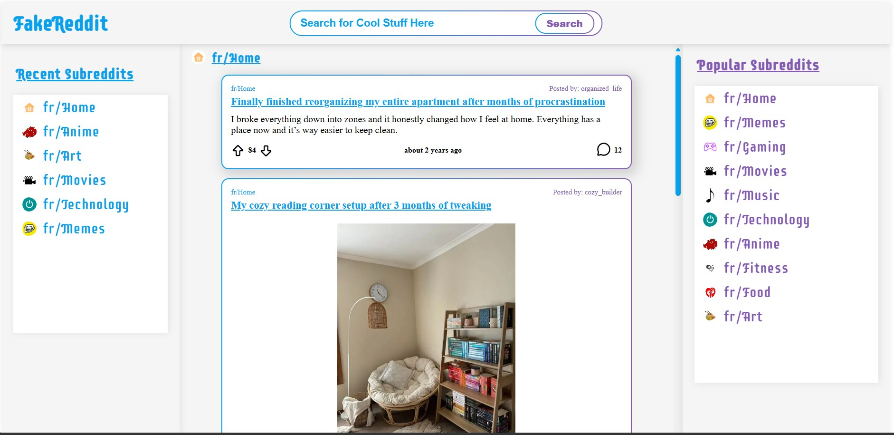
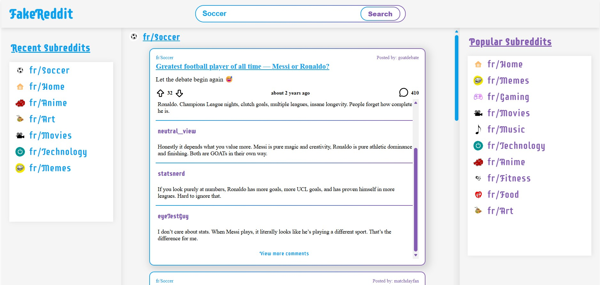
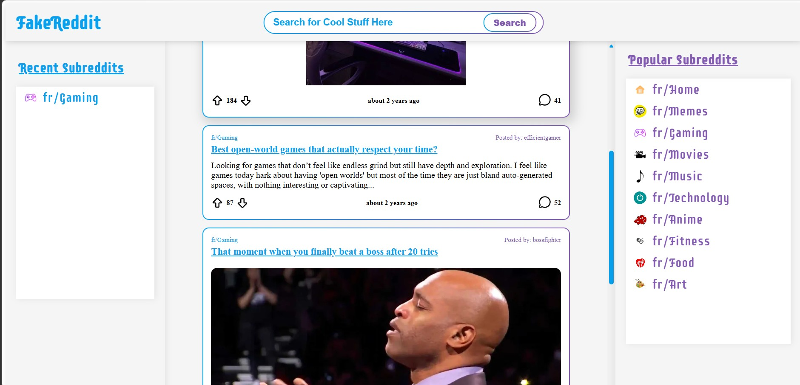

# Reddit Clone Web Application 

A Reddit-inspired web application built with React, Redux Toolkit, JavaScript, and Express.js that recreates core Reddit functionality, including browsing subreddit feeds, interacting with posts, voting, and viewing comments. The project also demonstrates automated testing and CI/CD using GitHub Actions

## Live Demo

https://cb28166.github.io/RedditClone_Web_Application/

## ScreenShots

### Home Feed



### Comments



### Expanded Post



## Features

- Browse posts from multiple subreddit feeds
- View both text and image posts
- Upvote and downvote posts using Redux state management
- Expand and collapse long text posts
- View and expand comment sections
- Responsive user interface
- Component and Redux reducer testing with Vitest and React Testing Library
- Continuous Integration and Continuous Deployment using GitHub Actions and GitHub Pages

## Technologies  

### Frontend

React
Redux Toolkit
Vite
JavaScript
HTML5
CSS3

### Backend

Express.js
Node.js

### Testing

Vitest
React Testing Library

### DevOps & Deployment

GitHub Actions
GitHub Pages

## Instillation

```bash
npm install
```

## Run Locally

```bash
npm run dev
```

## Run Tests

```bash
npm test
```

## Future Improvements

- Connect to the Official Reddit API to pull post and post data from
- Create a server backend to handle API request and data processing


